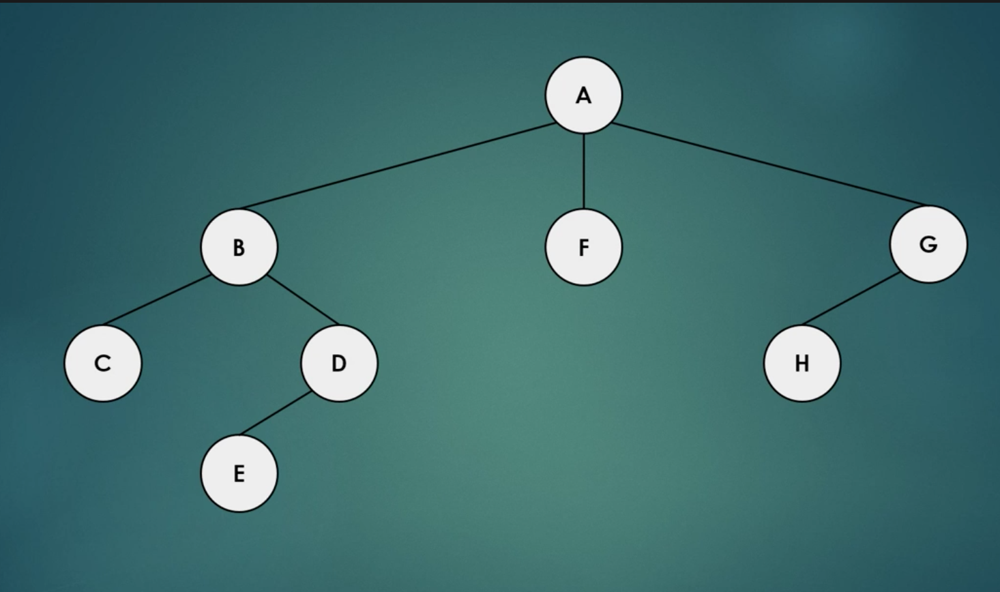

<h1> Breadth First Search </h1>

In this tutoral, we will be learning about Breadth-First Search.  Breadth-first search is an algorithm for searching tree or graph data structures.  It starts at the tree root, or a node of the graph, and searches level by level until it finds all the nodes in the tree.

</img>

For example, in the above tree, the algorithm would first find the A in the first row, then look for the B, F, and G in the next row.  It would stop searching along the F branch, because there are no more nearby, or "neighbor" nodes.  The algortithm would continue searching along the other two branches. 

